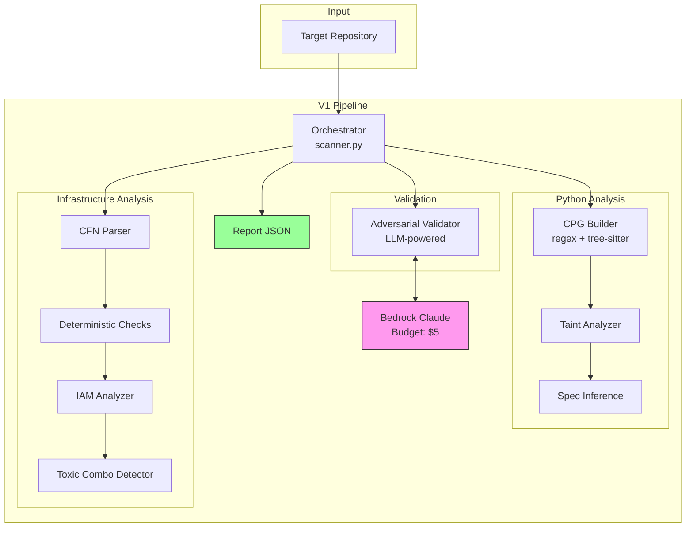
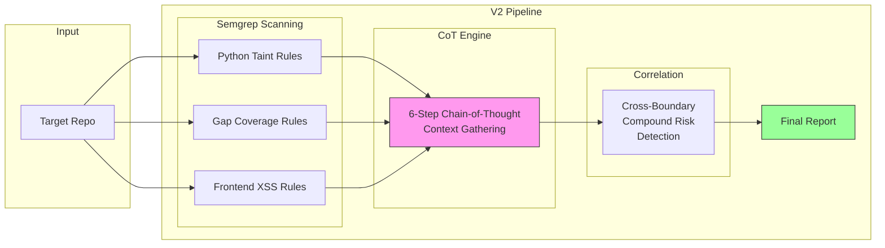
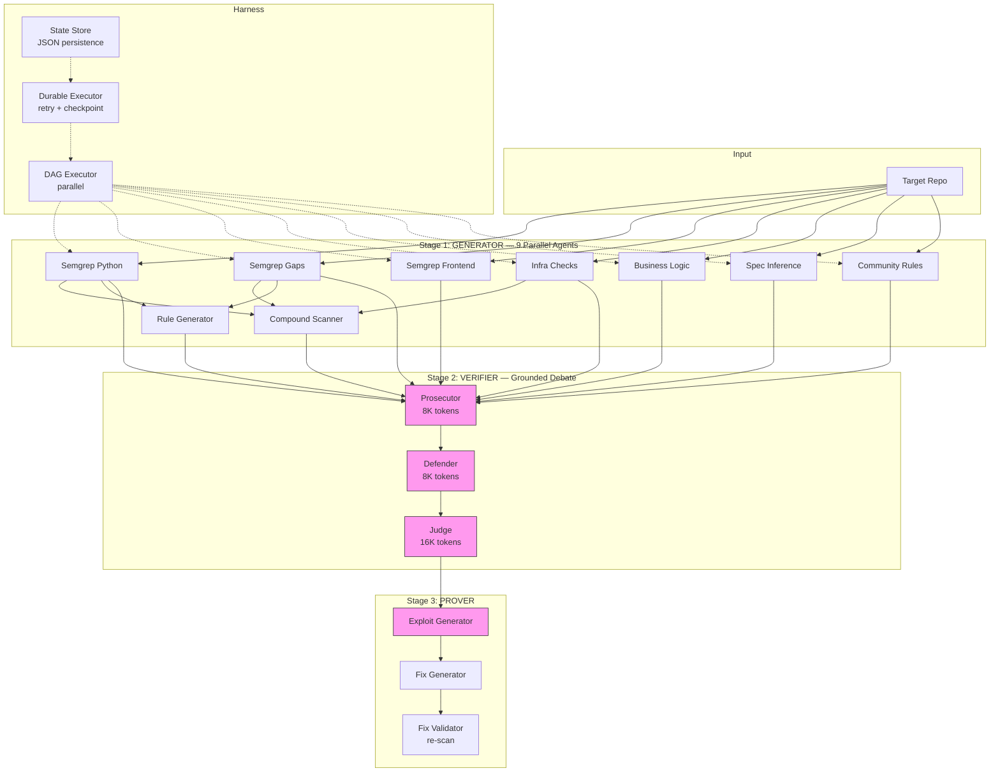
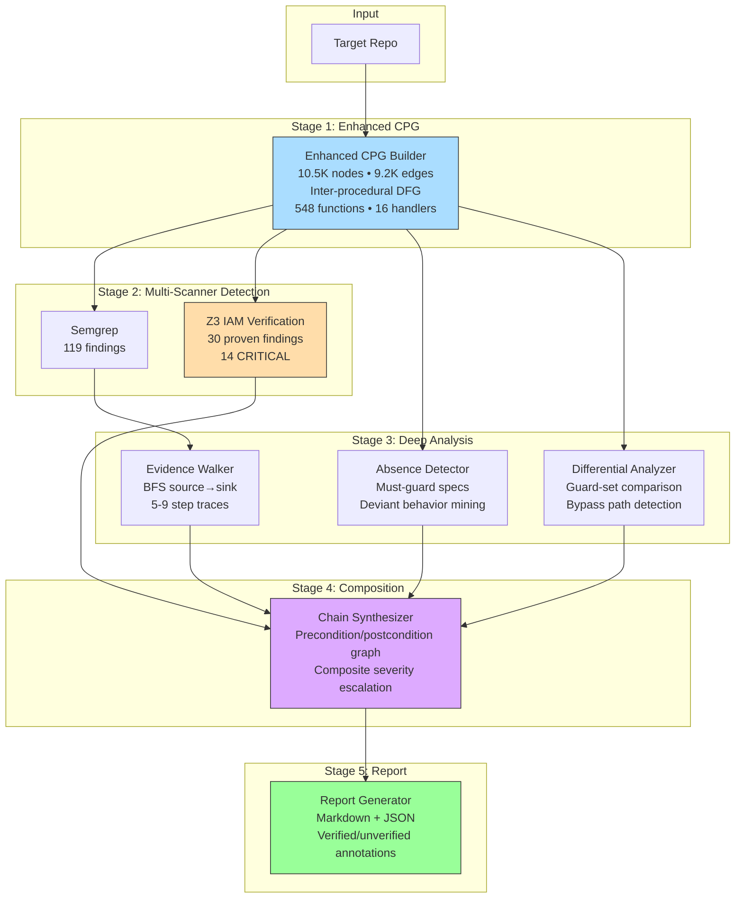
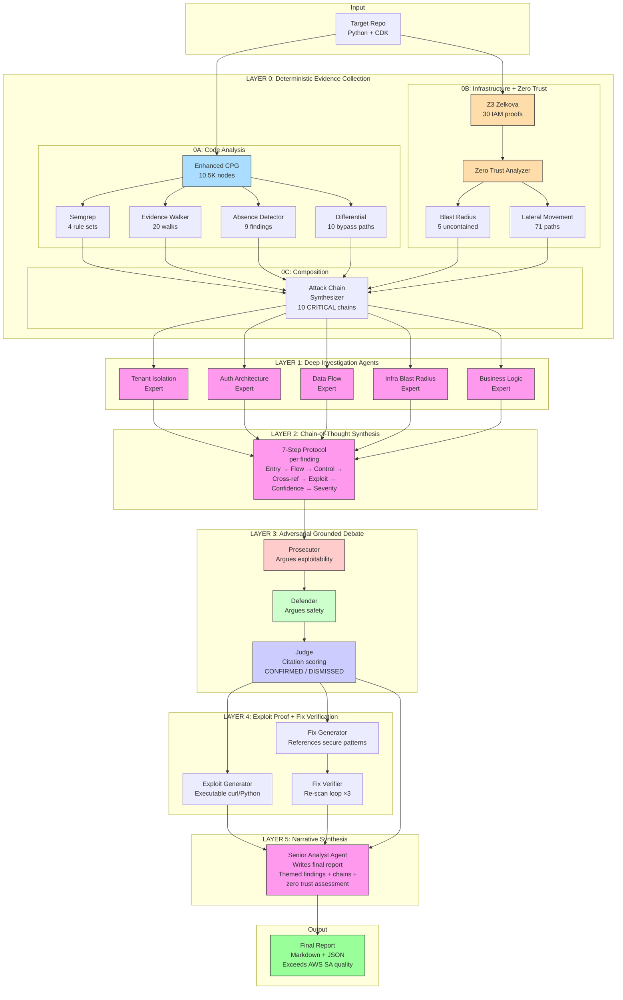
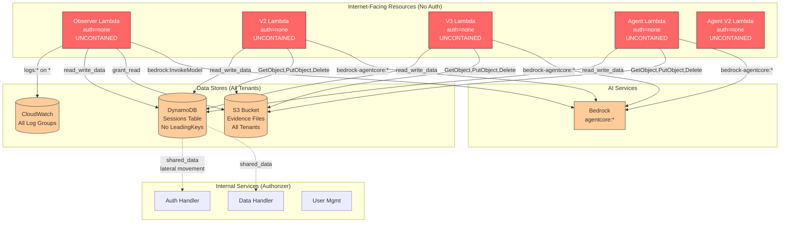
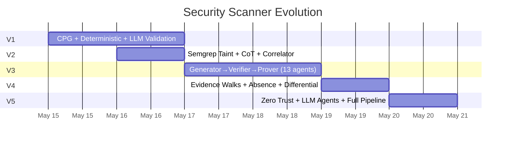
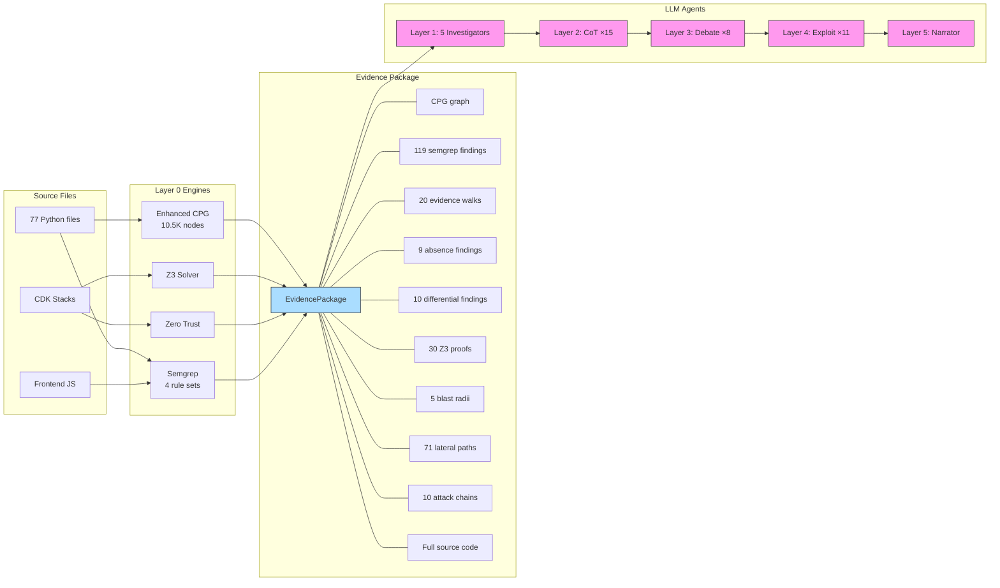
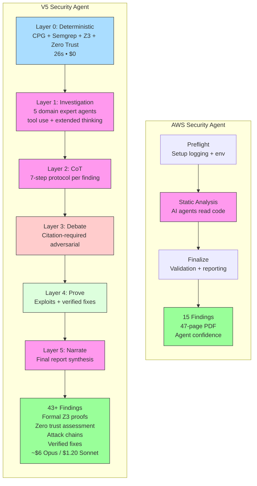
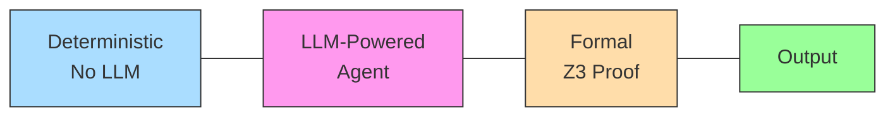

# Architecture Diagrams (V1 → V5)

## V1: Agent Architecture with CPG + Deterministic Checks

## V2: Semgrep Taint + Chain-of-Thought Reasoning

## V3: Generator → Verifier → Prover (13 Agents)

## V4: Deep Deterministic Analysis (No LLM)

## V5: Expert Security Code Reviewer (6-Layer Pipeline)

## V5 Zero Trust Detail: Assume-Breach Analysis

## Evolution Timeline

## V5 Data Flow: Evidence Package Assembly

## V5 vs AWS Security Agent: Architecture Comparison

## Legend

| Color | Meaning |
|-------|---------|
| Blue | Deterministic computation (CPG, graph algorithms) |
| Pink | LLM-powered agent (extended thinking, tool use) |
| Orange | Formal methods (Z3 SMT solver, mathematical proofs) |
| Red | Adversarial / attack (prosecutor, uncontained resources) |
| Green | Output / verified / safe |
