# V6 Architecture Diagrams

## Complete Pipeline — 7 Layers with Parallelism

```mermaid
flowchart TB
    REPO[Target Repository<br/>Python + CDK + Frontend]
    
    subgraph "LAYER 0: DETERMINISTIC FOUNDATION [$0 • 26s]"
        direction TB
        
        subgraph "Parallel Track 1: Code"
            CPG[Enhanced CPG<br/>10.5K nodes<br/>Inter-procedural DFG]
            SEM[Semgrep<br/>4 rule sets<br/>121 findings]
            EW[Evidence Walker<br/>BFS source→sink]
            ABS[Absence Detector<br/>Must-guard specs]
            DIFF[Differential<br/>Guard-set compare]
        end
        
        subgraph "Parallel Track 2: Infra + Zero Trust"
            CDK[CDK/CFN Parser]
            Z3[Z3 IAM Proofs<br/>LeadingKeys<br/>Wildcards<br/>Deny effect]
            ZT[Zero Trust<br/>Blast radius<br/>Containment<br/>Network isolation]
            LAT[Lateral Movement<br/>Graph<br/>71 paths]
        end
        
        subgraph "Parallel Track 3: Frontend"
            FSEM[Frontend Semgrep<br/>XSS + innerHTML]
            SEC[Secret Detection<br/>API keys in JS]
        end
        
        CHAIN[Chain Synthesizer<br/>Precondition/Postcondition<br/>Composition Graph]
        EP[EVIDENCE PACKAGE<br/>All Layer 0 outputs bundled]
    end
    
    REPO --> CPG & CDK & FSEM
    CPG --> SEM --> EW
    CPG --> ABS & DIFF
    CDK --> Z3 --> ZT --> LAT
    EW & ABS & DIFF & LAT & SEC --> CHAIN --> EP

    subgraph "LAYER 1: LLM DISCOVERY [$10-15 • 5min parallel]"
        direction TB
        
        subgraph "Track A: Novel Patterns [Sonnet]"
            NP1[Declared-but-unenforced]
            NP2[Data flow to external svc]
            NP3[Implicit contract violations]
            NP4[Attack surface expansion]
            NP5[Temporal/state issues]
        end
        
        subgraph "Track B: Zero-Day [Opus]"
            ZD1[CVE Variant Analysis]
            ZD2[Spec Inference → Z3 Proof]
            ZD3[Anomaly Exploration]
            ZD4[AI/LLM Attack Vectors]
            ZD5[Cross-Language Transfer]
            ZD6[Commit-Diff Seeding]
        end
        
        subgraph "Track C: Investigation [Sonnet]"
            INV1[Tenant Isolation Expert]
            INV2[Auth Architecture Expert]
            INV3[Data Flow Expert]
            INV4[Infra Blast Radius Expert]
            INV5[Business Logic Expert]
        end
        
        MERGE[Merge + Deduplicate<br/>All findings by root cause]
    end
    
    EP --> NP1 & ZD1 & INV1
    NP5 & ZD6 & INV5 --> MERGE

    subgraph "LAYER 2: CoT SYNTHESIS [$3-5 • 2min parallel]"
        COT[7-Step Protocol × N findings<br/>Entry → Flow → Control →<br/>Cross-ref → Exploit →<br/>Confidence → Severity]
    end
    
    MERGE --> COT

    subgraph "LAYER 3: VALIDATION [$5-8 • 3min parallel]"
        direction LR
        DEB[Adversarial Debate<br/>Prosecutor → Defender → Judge<br/>Citation-required]
        ZTC[Zero Trust Cross-Ref<br/>Amplify or contain?<br/>Severity adjustment]
        ZDV[Zero-Day Validator<br/>Extra scrutiny<br/>Prove + reproduce]
    end
    
    COT --> DEB & ZTC & ZDV

    subgraph "LAYER 4: PROOF [$3-5 • 2min parallel]"
        direction LR
        EXP[Exploit Generator<br/>Executable PoC<br/>curl / Python]
        FIX[Fix Generator<br/>+ Re-scan Verify<br/>Loop ×3]
        REG[Regression Test<br/>Generator<br/>pytest per finding]
    end
    
    DEB & ZTC & ZDV --> EXP & FIX & REG

    subgraph "LAYER 5: SYNTHESIS [$2-3 • 2min]"
        NAR[Narrative Synthesis<br/>Principal Consultant<br/>Themed report +<br/>Zero Trust section +<br/>Zero-Day section +<br/>Attack chains]
    end
    
    EXP & FIX & REG --> NAR

    subgraph "LAYER 6: LEARNING [$1 • 1min]"
        FB[Feedback Loop<br/>Novel → Semgrep rules<br/>Zero-day → Absence specs<br/>Variants → Chain capabilities<br/>Written to rules/discovered/]
    end
    
    NAR --> FB
    FB -.->|"Next scan"| CPG

    style CPG fill:#adf,stroke:#333
    style Z3 fill:#fda,stroke:#333
    style ZT fill:#fda,stroke:#333
    style ZD1 fill:#f66,stroke:#333,color:#fff
    style ZD2 fill:#f66,stroke:#333,color:#fff
    style ZD3 fill:#f66,stroke:#333,color:#fff
    style ZD4 fill:#f66,stroke:#333,color:#fff
    style ZD5 fill:#f66,stroke:#333,color:#fff
    style ZD6 fill:#f66,stroke:#333,color:#fff
    style NP1 fill:#f9e,stroke:#333
    style NP2 fill:#f9e,stroke:#333
    style NP3 fill:#f9e,stroke:#333
    style NP4 fill:#f9e,stroke:#333
    style NP5 fill:#f9e,stroke:#333
    style INV1 fill:#fcf,stroke:#333
    style INV2 fill:#fcf,stroke:#333
    style INV3 fill:#fcf,stroke:#333
    style INV4 fill:#fcf,stroke:#333
    style INV5 fill:#fcf,stroke:#333
    style DEB fill:#fcc,stroke:#333
    style NAR fill:#cff,stroke:#333
    style FB fill:#cfc,stroke:#333
    style EP fill:#ff9,stroke:#333
```

## Layer 0: Parallel Deterministic Execution

```mermaid
gantt
    title Layer 0 Parallel Execution (26s total)
    dateFormat ss
    axisFormat %S s

    section Code Track
    CPG Build (tree-sitter)           :cpg, 00, 3s
    Semgrep (4 rule sets)             :sem, after cpg, 12s
    Evidence Walks                     :ew, after sem, 1s
    Absence Detector                   :abs, after sem, 1s
    Differential Analyzer              :diff, after sem, 1s

    section Infra Track
    CDK Parse                          :cdk, 00, 1s
    Z3 IAM Proofs (30 findings)        :z3, after cdk, 5s
    Zero Trust Analyzer                :zt, after z3, 2s
    Lateral Movement Graph             :lat, after zt, 1s

    section Frontend Track
    Semgrep Frontend Rules             :fsem, 00, 3s
    Secret Detection                   :sec, after fsem, 1s

    section Synthesis
    Chain Synthesizer                  :chain, after diff, 1s
    Evidence Package Assembly          :ep, after chain, 1s
```

## Layer 1: Three Parallel LLM Discovery Tracks

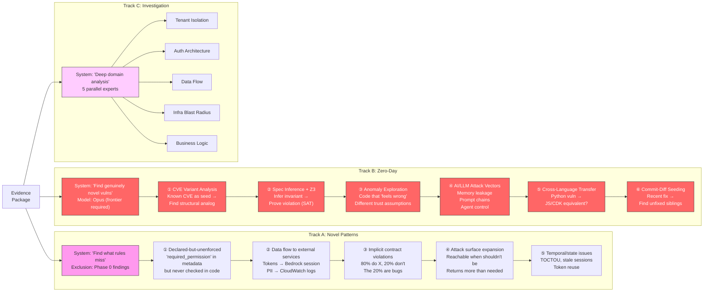

## Track B: Zero-Day Discovery — Detail

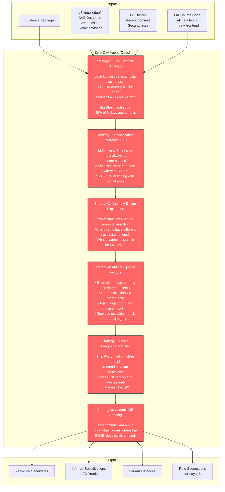

## Layer 3: Validation — Three Parallel Validators

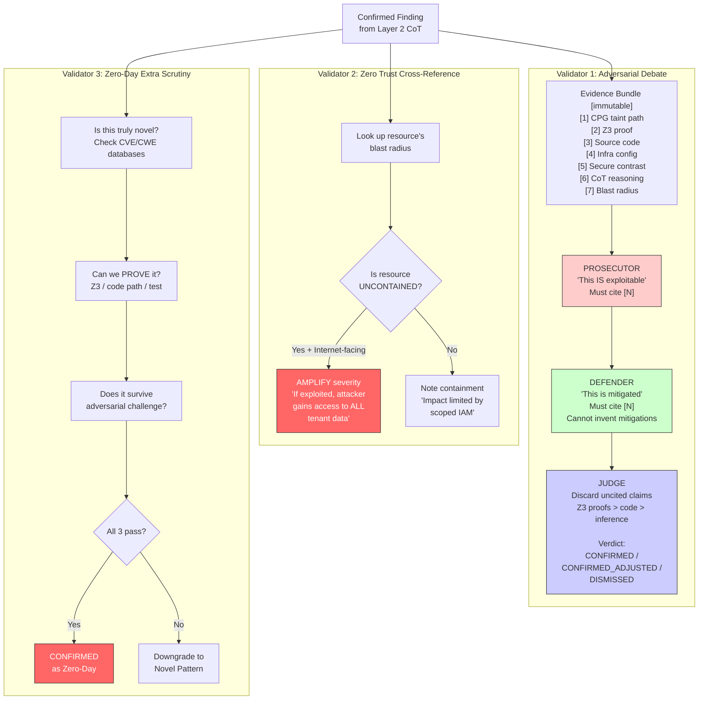

## Layer 6: Self-Improving Feedback Loop

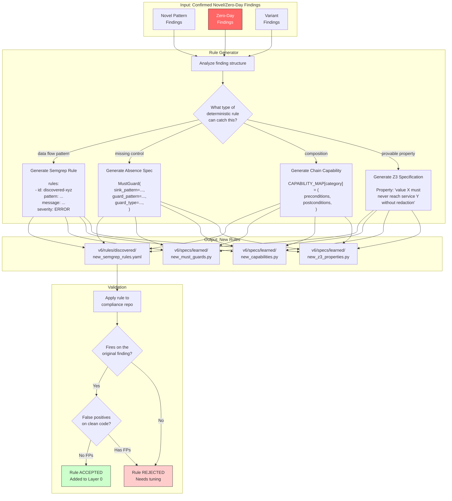

## The Flywheel: Scanner Gets Smarter Over Time

```mermaid
flowchart LR
    subgraph "Scan 1"
        S1_L0["Layer 0<br/>15 known"]
        S1_L1["Layer 1<br/>+2 novel<br/>+1 zero-day"]
        S1_L6["Layer 6<br/>3 new rules"]
        S1_L0 --> S1_L1 --> S1_L6
    end
    
    subgraph "Scan 2"
        S2_L0["Layer 0<br/>18 known<br/>(+3 from rules)"]
        S2_L1["Layer 1<br/>+1 novel"]
        S2_L6["Layer 6<br/>1 new rule"]
        S2_L0 --> S2_L1 --> S2_L6
    end
    
    subgraph "Scan 3"
        S3_L0["Layer 0<br/>19 known"]
        S3_L1["Layer 1<br/>+0 novel"]
        S3_L6["Layer 6<br/>Skip"]
        S3_L0 --> S3_L1 --> S3_L6
    end
    
    subgraph "Scan N (CI/CD)"
        SN_L0["Layer 0 ONLY<br/>19 known<br/>$0 • 26s"]
    end
    
    S1_L6 -->|"rules added"| S2_L0
    S2_L6 -->|"rules added"| S3_L0
    S3_L6 -->|"nothing new"| SN_L0

    style S1_L1 fill:#f9e,stroke:#333
    style S2_L1 fill:#f9e,stroke:#333
    style S3_L1 fill:#efe,stroke:#333
    style SN_L0 fill:#cfc,stroke:#333
```

## Cost Optimization: Model Selection Per Component

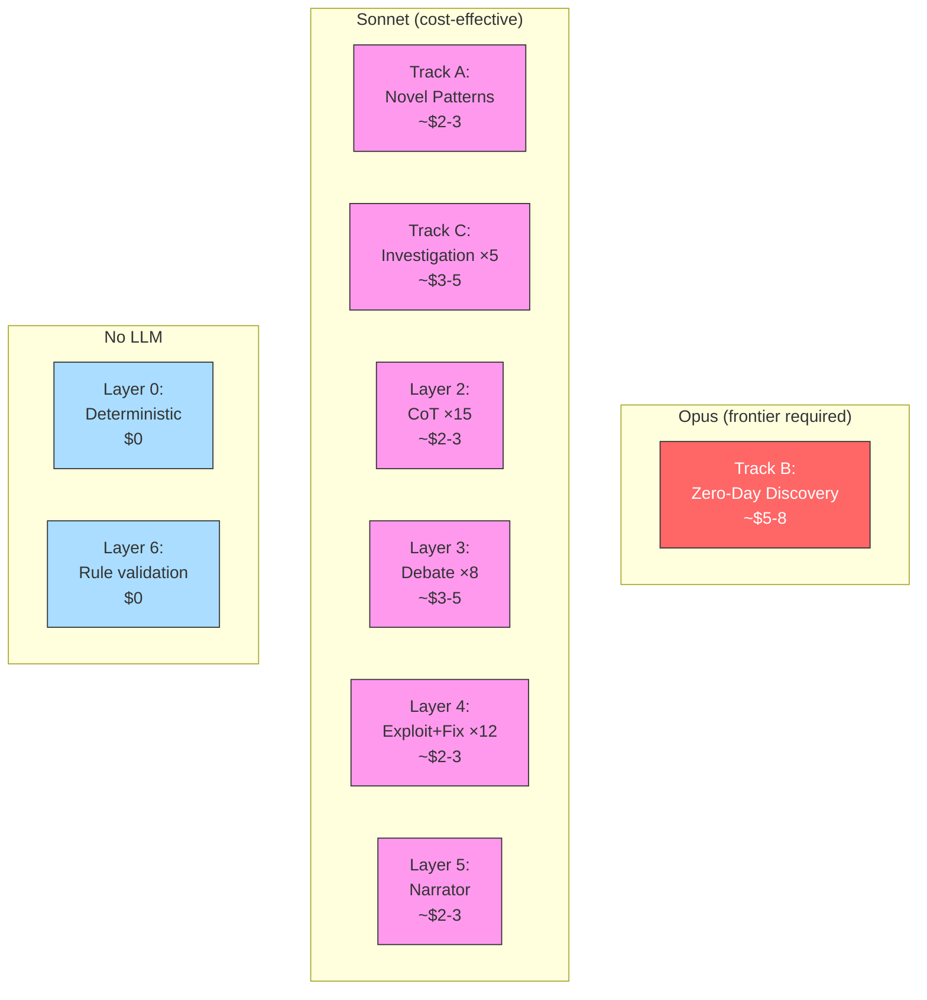

## Zero Trust: Assume-Breach Blast Radius Map

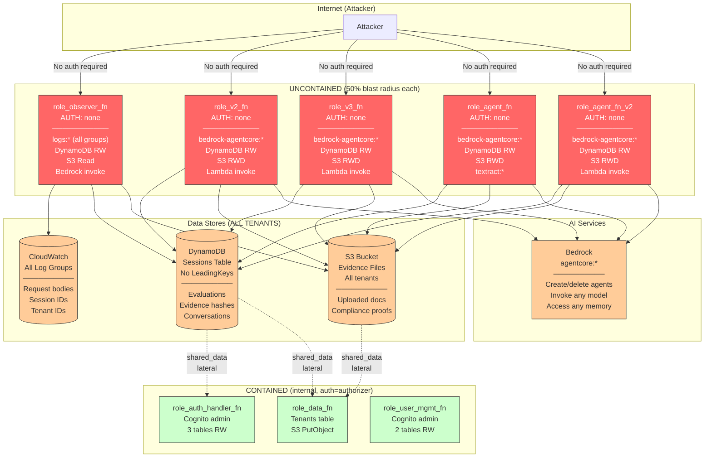

## Prompt Engineering Process Per Agent

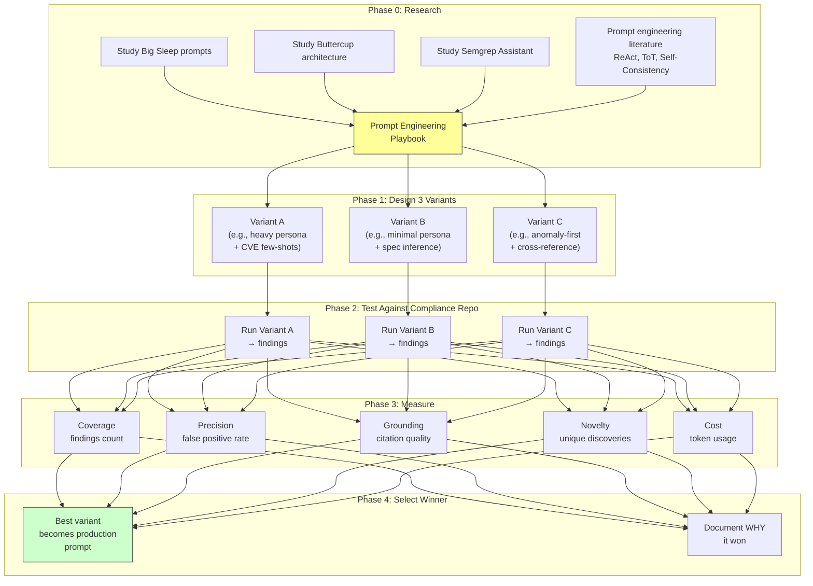

## V6 vs AWS Security Agent vs Pure LLM — Final Comparison

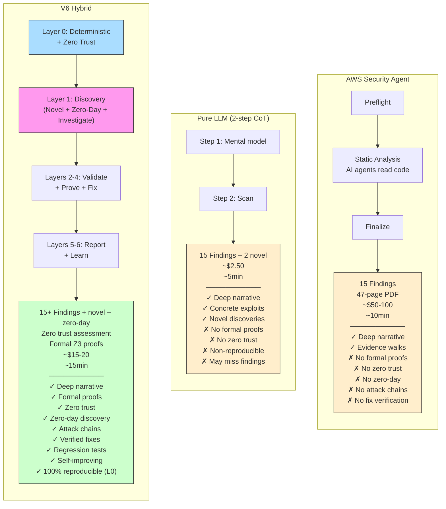

## Legend

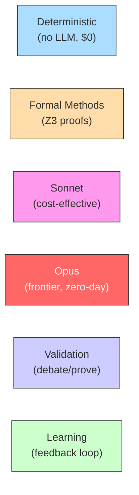

| Color | Meaning |
|-------|---------|
| Blue | Deterministic computation — no LLM, $0, reproducible |
| Orange | Formal methods — Z3 SMT solver, mathematical proofs |
| Pink | LLM (Sonnet) — cost-effective reasoning |
| Red | LLM (Opus) — frontier model for zero-day discovery |
| Purple | Validation — debate, cross-reference, extra scrutiny |
| Green | Learning / output — feedback loop, final report |
| Yellow | Evidence package — shared data between layers |
